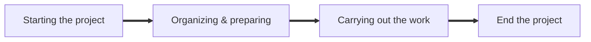
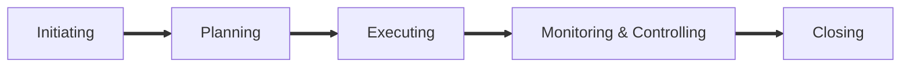

# COMP9820 Engineering Project Management(2024T3)

## Week1

### What is a Project?
A `project` is a `temporary` endeavor undertaken to create a `unique` product,service and result. 
* Finite timespan （有限的时间跨度）
* Final deliverables（最终可交付成果）

### What is a Project Management?
A `Project Management` is the `application` of knowledge, skills, tools and techniques to project activities to meet project requirements.  

### What does a Project Manager do?
#### Project Manager
The `project manager` is the person assigned to lead the team, responsible for achieving the project pbjectives. 

#### Good project manager
A good project manager should have following skills but not limited to:
* Technical skills（技术技能）
* Management proficiencies（管理能力）(develop and manage scope, schedules, costs, quality, resources, risks)
* Interpersonal skills（人际交往能力）

### Project Life Circle
A `project life circle` is `the series of phases`(`Phase`: time bound, with a start and end or control point) that a project passes through from its beginning to its completion. 
**
Project Phases
**

### Project Process Groups

**ProjectPhases≠ProjectGroup**

#### Initiating(Week1-3)
* Deciding `what` you are going to do, showing `why` this is beneficial, get commitments of stakeholders, and obtaining `authorisation` to start the project.
* Key precesses:
  * Identify `stakeholders`
  * Defining the `project scope`:problems, objectives, requirements, deliverables etc.
  * Develop the `project charter`
  * Assign a PM

 #### Planning(Week1-6)
 * Deciding `how` you are going to acheive the objectives and `create the roadmap` that you will follow.
 * Key process
   * `Work Breakdown Structure(WBS)`
   * `Schedule`:define activities, activity duration and scheduling
   * `Cost`:estimate cost and determine budget
   * `Quality`:set quality targets and measures
   * `Resource`:HR, procurement plan, activity resources
   * `Communication`:tools, frequency
   * `Risk Management`:identify and analyse risks, solutions
   *  Procurement plan(采购计划)
   *  Develop the `Project Management Plan(PMP)`:integrate components

  #### Executing(Outside the Scope)
  * When you get to execute the project plan, you bring resources on board, get people to perdorm the work, and manage the project.
  * Key process:
    * Develop and manage the team
    * Directing project work
    * Completing work planned in PMP
    * Coodinating resources
    * Managing stakeholders
    * Integrating activities整合活动(project managers's most critical job)
    * Conduct procurements

 #### Monitor & Control(Week7-8)
 * While the work is underway, you need to `track the progress, monitor and control the project`. If the project is out of track, work out the solutions.
 * Key processes:
   * Gather data: starting date, duration, costs
   * Evaluate progress: compare against the plan, check objectives
   * Readjust your plan
   * Request the change:approve or reject the change
   * Perform integrated change: manage scope, schedule, cost, quality after the change
   * Report progress of the change
   * Monitor and control risks

 #### Closing(Week9)
 * When the project is over, you should post-review the project, evaluate success, and celebrate acheivements.
 * Key processes:
   * Interpret success
   * Identify lessons learned
   * Measure stakeholder satisfaction
   * Finalise costs
   * Formally close out project activities
   * Give recognition for achievements 
