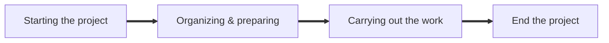
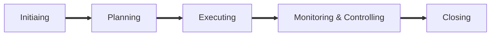

# COMP9820 Engineering Project Management(2024T3)

## Week1

### What is a Project?
A `project` is a `temporary` endeavor undertaken to create a `unique` product,service and result. 
* Finite timespan （有限的时间跨度）
* Final deliverables（最终可交付成果）

### What is a Project Management?
A `Project Management` is the `application` of knowledge, skills, tools and techniques to project activities to meet project requirements.  

### What does a Project Manager do?
#### Project Manager
The `project manager` is the person assigned to lead the team, responsible for achieving the project pbjectives. 

#### Good project manager
A good project manager should have following skills but not limited to:
* Technical skills（技术技能）
* Management proficiencies（管理能力）(develop and manage scope, schedules, costs, quality, resources, risks)
* Interpersonal skills（人际交往能力）

### Project Life Circle
A `project life circle` is `the series of phases`(`Phase`: time bound, with a start and end or control point) that a project passes through from its beginning to its completion. 
**
Project Phases
**

### Project Process Groups

